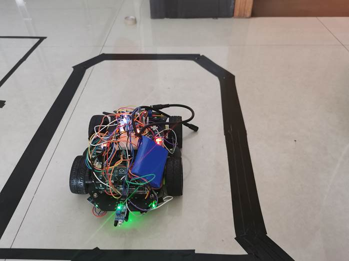

## :hand:Arduino-Traced-By-Line-SuperCar

> - Bluetooth remote control + automatic line patrol car based on Arduino
>
> - 基于Arduino的蓝牙遥控+自动循迹小车

### :sunny:项目简介：

本项目是基于Arduino制作的一个智能循迹小车，小车完成的主要功能是能够自主识别黑色（或白色）引导线并根据黑线（或白色）实现快速稳定的循线行驶。小车系统以Arduino单片机为系统控制处理器。系统采用三路红外传感获取赛道信息，以便控制小车在偏转赛道时及时差速矫正，采用一路红外避障模块进行前方道路的避障。在智能循迹的同时，还可以通过连接蓝牙模块，手动遥控让小车模拟全国机动车驾驶标准化考试的不同考核内容，如：倒车入库，S弯行驶、预警鸣笛、正确使用转向灯、侧方位停车等。此外，对整个控制软件进行设计和程序的编制以及程序的调试，并最终完成软件和硬件的融合，实现小车的预期功能。

### :cyclone:项目背景：

当前世界正在经历一场革命性的变化。正在全球展开的信息和信息技术革命，正以前所未有的方式对社会变革的方向起着决定作用，其结果必定导致信息社会在全球的实现。具体表现为，首先，在生产活动的范围广泛的工作过程中，引入了信息处理技术，从而使这些部门的自动化达到一个新的水平；其次，电讯与计算机系统合而为一，可以在几秒钟内将信息传递到全世界的任何地方，从而使人类活动各方面表现出信息活动的特征；最后，信息和信息机器成了一切活动的积极参与者，甚至参与了人类的知觉活动、概念活动和原动性活动。在此进展中，信息/知识正在以系统的方式被应用于变革物质资源，正在替代劳动成为国民生产中“附加值”的源泉。这种革命性不仅会改变生产过程，更重要的是它将通过改变社会的通讯和传播结构而催生出一个新时代、新社会。在这个社会中，信息/知识成了社会的主要财富，信息/知识流成了社会发展的主要动力，信息/情报源成了新的权力源。随着信息技术的普及，信息的获取将进一步实现民主化、平等化，这反映在社会政治关系和经济竞争上也许会有新的形式和内容，而胜负则取决于谁享有信息源优势。信息和信息技术的本质特点，在社会和经济发展方面也必将带来全新的格局。

 

智能化，归根结底，是人工智能技术发展带来的一种智能产品，它能够实现智能操控、管理以及升级等功能，赋予产品智能的性能，这是不同于普通产品，所以算是历史潮流发展的重要进程。所以智能化的小车可以代替人们在恶劣的环境下或者耗费大量时间人力的环境下完成一些人类无法介入的特殊任务。

### :cloud:技术原理：

> 下列作图皆由绘图软件Fritzing绘制完成

#### Arduino 连线图：

####  PCB模块

####  原理图：

#### 流程图：

#### 工作原理

  TCRT5000传感器具有一对红外线发射与接收管，发射管发射出一定频率的红外线，当发射出的红外线没有被反射回来或被反射回来但强度不够大时，光敏三极管一直处于关断状态，此时模块的输出端为低电平，指示二极管一直处于熄灭状态；被检测物体出现在检测范围内时，红外线被反射回来且强度足够大，光敏三极管饱和，此时模块的输出端为高电平，指示二极管被点亮。该传感器模块对环境光线适应能力强，其当检测方向遇到障碍物(反射面)时，红外线反射回来被接收管接收,经过比较器电路处理之后，绿色指示灯会亮起，同时信号输出接口输出数字信号(一个低电平信号)，可通过电位器旋钮调节检测距离，有效距离范围2~30cm，工作电压为3.3V-5V。

  由于黑色具有较强的吸收能力，当循迹模块发射的红外线照射到黑线时，红外线将会被黑线吸收，导致循迹模块上光敏三极管处于关闭状态，此时模块上一个LED熄灭。在没有检测到黑线时，模块上两个LED都保持高亮。循迹模块安装
  循迹模块的工作一般要求距离待检测的黑线距离1-2cm，这里我用铜柱固定循迹模块，每个模块之间可以留1cm左右的距离。传感器在接收到反射不同的距离的时候“AO”引脚电压会不同，是模拟信号，“DO”是数字信号输出。因为在这里我们只用判断是否检测到黑线，因此使用“DO”数字信号即可，当然如果用模拟口，通过串口显示台查看再人为规定探测范围也是可以的。

### :zap:实现方法与步骤：

#### 准备材料

##### 黑色电工胶布

> 黑色胶布用于搭建小车运行的“轨道”，选用黑色宽度18mm左右的即可。 

##### 循迹&&避障模块

> 在此我们使用循迹模块TCRT5000，该模块体积小，灵敏度较高，还可以通过转动上面的电位器来调节检测范围。

##### 蓝牙模块

> 蓝牙模块用于控制小车不同线路的运行情况，如倒车、前进、控制方向等，循迹是小车自主寻迹，无需蓝牙控制

##### 跑道的搭建   

> 找一块干净的地面，贴上准备好的黑色电工胶布。由于小车自身结构的原因，转弯的时候尽可能增大转弯半径，在跑道尽头如图中那样拉一条黑色横线，用于小车识别终点。

### :snowflake:循迹效果展示

#### 在起点出准备出发

 

#### 弯道中

 

#### 识别到终点后停止

#### 倒车入库

 

#### 候车区等待：

#### S弯绕行

#### 侧方位停车

 

#### 遇到障碍车辆（鸣笛+双跳led灯）

 

### :snowman:关键技术或创新点：

#### 模块特色：

> 1.	采用TCRT5000红外反射传感器
> 2.	检测距离：1mm~8mm适用，焦点距离为2.5mm
> 3.	比较器输出，信号干净，波形好，驱动能力强，超过15mA。
> 4.	工作电压3.3V-5V
> 5.	输出形式 ：数字开关量输出（0和1）
> 6.	设有固定螺栓孔、铜柱，方便拆卸安装
> 7.	配备8.5*5.5cm面包板
> 8.	使用L298N驱动电机驱动小车
> 9.	稳定的LM2596S DC-DC 降压模块

#### 关键技术：

> 1.	L298N驱动电机
> 2.	TCRT5000红外反射传感器
> 3.	C++程序设计语言
> 4.	Arduino芯片
> 5.	智能小车搭建

